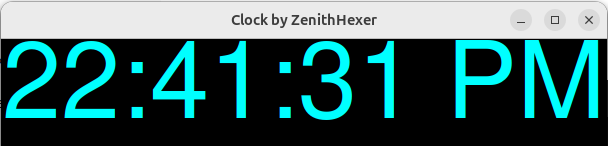

# Clock
# Tkinter Clock Application

This is a simple clock application built with Python's Tkinter library.

 <!-- Add a screenshot of your app here -->

## Features

- Displays the current time in a 12-hour format.
- Updates every second.

## Requirements

- Python 3.x
- Tkinter (comes pre-installed with Python)

## Installation

To run this application, you need to have Python and Tkinter installed on your machine. You can check if Python is installed by running:

```bash
python --version
```
# Steps to Install Tkinter (if not installed
1. For Ubuntu/Debian:
    ```bash
    sudo apt update
    sudo apt install python3-tk
    ```
2. For Windows:
Tkinter comes pre-installed with Python. If you installed Python, you should already have Tkinter.
  
# How to Run

1. Clone the repository:

   ```bash
   https://github.com/zenithhexer/Clock.git
   ```
2. Run the application:

   ```bash
   python clock.py
   ```

# Usage
Once you run the application, a window will open displaying the current time, updating every second.

# Contributing:
If you'd like to contribute to this project, please fork the repository and create a pull request.


